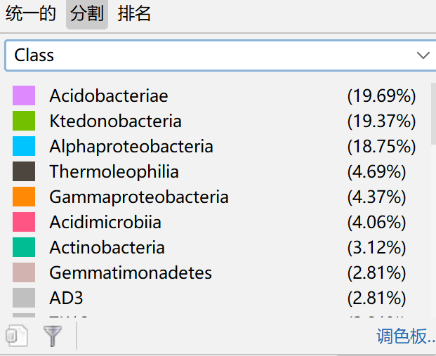
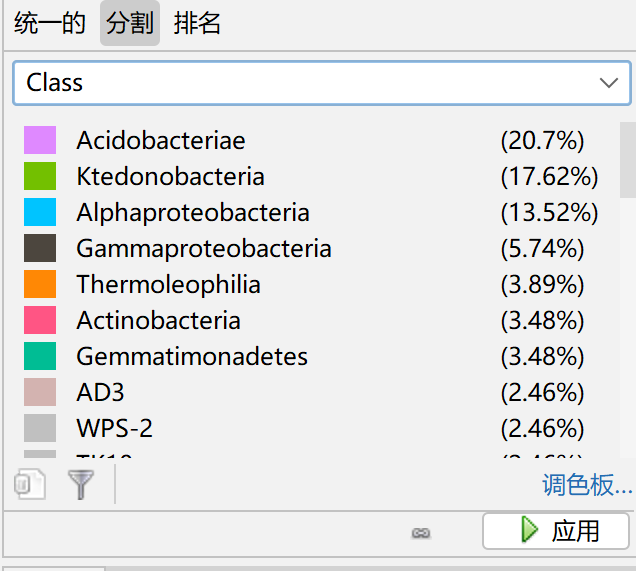
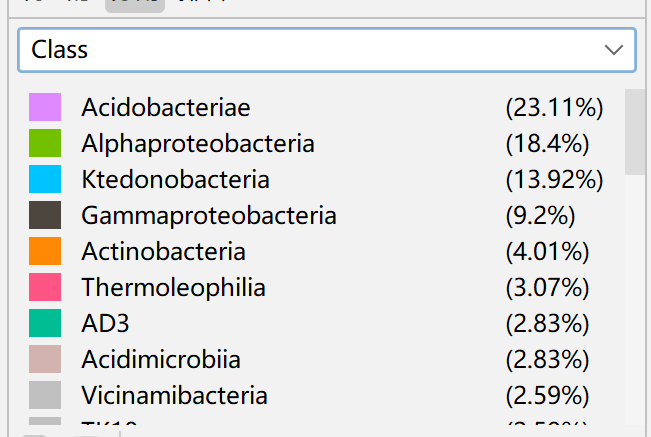

# 2025-
（为什么明明建好了却不告诉我害我莫名奇妙多建了一个库……）
# 淹水梯度下湿地植物-微生物-重金属互作机制研究

## 项目背景

为研究七种主要重金属成飞在湿地水稻田中的积累对土壤微生物群落产生的影响以及对植物产生的影响。本研究以湿地植物水香薷为研究对象，探讨不同淹水深度下植物对重金属的富集规律，以及土壤微生物群落的响应特征。

> 📄 本项目基于我在温州大学生命与环境科学学院担任研究助理期间参与的课题，相关论文正在审稿中。

## 科学问题

1. 淹水深度如何影响水香薷各生长阶段的重金属富集效率？
2. 微生物群落结构是否随淹水梯度变化，并与植物重金属吸收相关？

## 使用工具

| 主要工具 | 用途 |
| :--- | :--- |
| R / RStudio | 数据处理与可视化 |
| tidyverse (dplyr, tidyr) | 数据清洗与转换 |
| vegan | 多样性分析、RDA、Mantel test |
| ggplot2 / pheatmap | 图表绘制 |
| igraph / Cytoscape | 网络图构建与美化 |
用的包实在是太多了有点弄不完，写了几个主要的多个代码都有应用的而不是
## 核心分析内容

本项目包含以下分析模块：

## 核心分析与关键发现

### 发现一：淹水重塑了细菌群落结构

**门水平上**，所有样本中优势菌门为 **Acidobacteriota** 和 **Chloroflexi**。**Acidobacteriota**呈现出中期相对丰度随着水位高度上升，后期相对丰度却反之的情况，表明淹水条件与植物生长时期两者之间形成了独特的相互作用。相应的，**Chloroflexi**呈现出中期相比于前期相对丰度减小，后期低水位时相对丰度大幅上升，高水位反而再次减小的独特属性。


**Alpha多样性**（Shannon指数）显示，中度淹水（5cm）条件下多样性最高，而高淹水（9cm）显著降低，提示极端淹水抑制了部分敏感菌群。


**Beta多样性**（PCoA分析）显示，低、中、高三组淹水处理的样本明显分离（PERMANOVA，p < 0.05），说明淹水深度是驱动细菌群落结构变化的核心因素。


### 发现二：特定菌群对淹水有规律性响应

**属水平热图**显示出的菌群呈现数量小且种类多的情况，难以判别到属类的优势菌群。


### 发现三：重金属的不同形态与重金属在植物不同部分的吸收存在显著关联，且重金属与微生物群落的生长息息相关

**Mantel test** 结果显示，绝大部分被检测的重金属，其特定形态可以影响植物的吸收以及不同植物部位的沉积。也许特定菌群也可能通过改变重金属形态间接影响其生物有效性。


**关键物种网络图**识别出 **Acidobacteriae**、**Alphaproteobacteria**、**Ktedonobacteria** 等核心菌属，它们在网络中起连接作用，且其丰度与有效态重金属浓度显著相关。





这里就只举这几张图因为几乎所有的都大差不差了，最前面几乎都是这三个.

### 发现四：淹水深度是驱动群落变化的核心因子

**冗余分析（RDA）** 表明，不同金属元素的形态以及吸收受到环境影响，侧面证明了淹水对于土壤的理化环境变化将连锁作用于重金属形态和微生物群落。这说明淹水不仅直接作用于植物，还通过重塑微生物群落间接影响重金属的迁移。


### 主要结论

> 本研究初步揭示了淹水梯度通过改变土壤微生物群落结构，进而调控水香薷对重金属富集的潜在机制。其

> 以上所有图表均位于 `./output/` 文件夹中，可点击查看。

## 数据说明

本研究的原始数据来自实验采样和 16S rRNA 高通量测序结果，因涉及正在审稿的论文内容，原始数据暂不公开。

本仓库的 R 代码中包含 **模拟数据生成模块**，运行 `main.R` 即可生成结构一致的模拟数据来演示全部分析流程。

```r
# 快速运行
# 1. 打开 main.R
# 2. 点击全选运行
# 3. 所有图表自动生成到 ./output/ 文件夹
